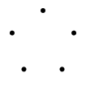

# Each slide is its own level 1 heading

{width=318}

## Sub heading = smaller title

text goes here, image, whatever.

1. ordered list
2. number 2
3. #3

# Individually reveal list items

> 1. like so
> 2. and this

> - unordered
> - also
> - work

# Code with syntax highlighting

```rust
fn main() {
    println!("Hello, world!");
}
```
